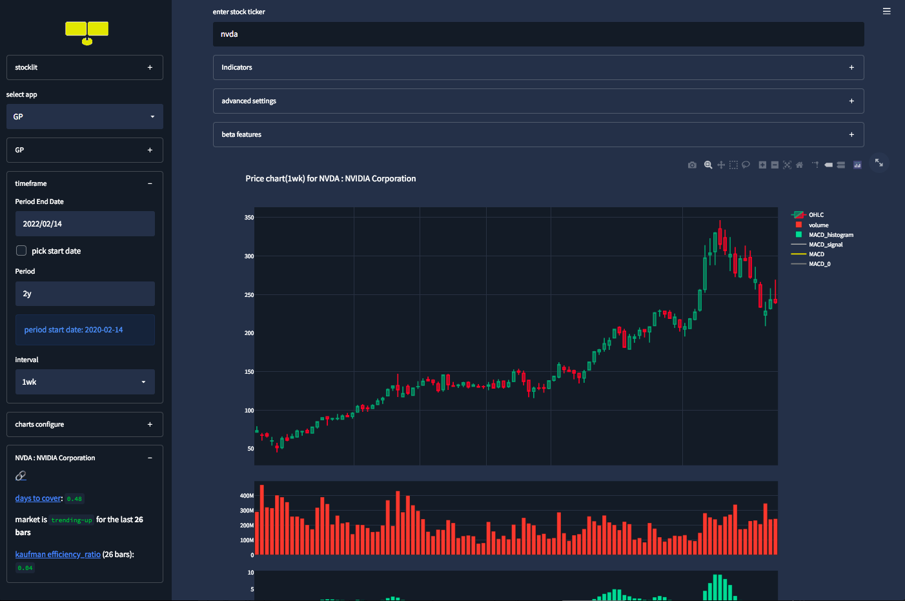

## stocklit
stock x [streamlit](https://streamlit.io/), is inspired by the Bloomberg Terminal and serves as a "google-search" for stocks. Under the hood, the stock data is powered by [yfinance](https://github.com/ranaroussi/yfinance).

It's deployed using [streamlit share](https://www.streamlit.io/sharing): 

